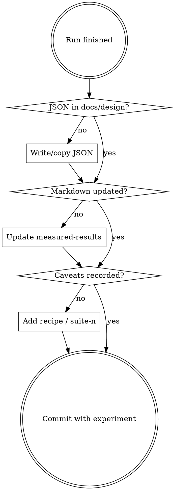

# Documenting experiment results

## Overview

**Every experiment updates `docs/design/`.** JSON mirrors plus markdown headlines
are the durable ledger. `outputs/` alone is not enough.

## Workflow

1. Identify the doc home (map below).
2. Persist JSON under `docs/design/` (scripts often mirror — verify it matches
   **this** run).
3. Update markdown measured-results: IDs run, pass/fail, recipe (device, steps,
   backend, matrix set, suite `n`, honesty mode).
4. Do not overclaim (fixture clear ≠ production ship).
5. Commit docs with the experiment.

## Artifact → doc map

| Run / script | JSON (docs) | Markdown |
| --- | --- | --- |
| `run_quality_matrix` | `quality-matrix-results.json` | `quality-experiment-matrix.md` (Vn section) |
| `run_grammar_matrix` | `grammar-matrix-results.json` | `quality-experiment-matrix.md` (X) |
| `reproduce_baseline` | `baseline-reproduction-results.json` | `quality-experiment-matrix.md` |
| `run_phase_pipeline` | `phase-abc-results.json` | `quality-experiment-matrix.md` |
| `run_perf_matrix` | `perf-matrix-results.json` | `perf-experiment-matrix.md` (+ `runtime-performance.md` if latency claim changes) |
| `bench_accel --microbench` | `train-microbench.json` | `runtime-performance.md` / `accel-parallel.md` |
| `bench_telemetry` | `cycle-telemetry.json` | `telemetry.md` if narrative changes |
| `evaluate_model --ship-gates` | summarize scoreboard/gates for the claim | `adversarial-review.md` and/or matrix doc |
| `profile_generate` | promote if used for claims | perf / runtime docs |

No row? Still add a measured-results note next to the lever's design doc and a
`docs/design/*-results.json` matching existing summary shapes.

## Markdown shape

Match existing sections: link the JSON, state host/recipe/`rico_held` n, table
of ID → metrics → ship/perf outcome, honesty caveats. Update in place when
re-running the same IDs; keep invalidated historical rows labeled as such.

## Red flags

- Results only in stdout / PR body
- JSON updated, measured-results table not
- "Document after the full matrix"
- Ship pass without suite sizes / honesty mode
- Weakening gates instead of documenting a fail

| Mistake | Fix |
| --- | --- |
| New JSON schema | Extend the existing summary shape |
| Only README | Matrix/design docs are the scoreboard |
| Training loss as fidelity | Use parse / `placeholder_fidelity` / struct / reward |
| Skipping failed runs | Document fail + blocker |
