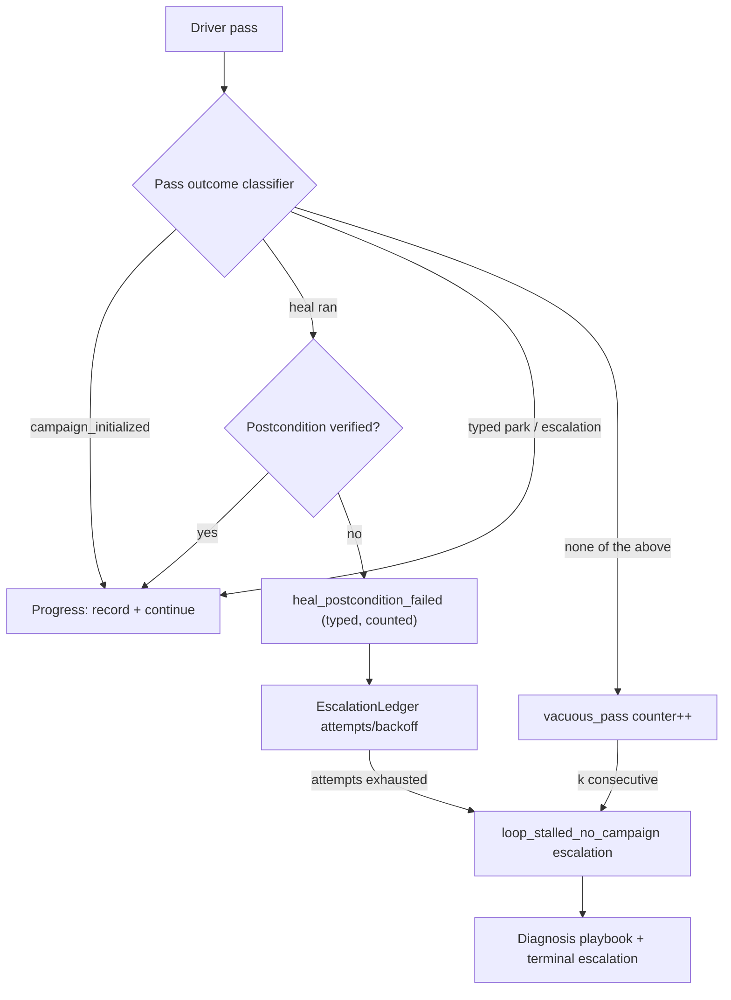

# Fail-closed self-healing for hands-off hill-climbing

Design record, 2026-08-21. Status: **proposed** (not yet implemented). Owner:
autotrain continuous loop (`scripts/run_autotrain_continuous.py`,
`scripts/run_autotrain_supervisor.py`, `src/slm_training/autoresearch/heal/`).

## Problem class

The loop's 2026-08-21 stall migrated through three blockers (commit-vs-hook
livelock → campaign-lock digest crash → vacuous heal churn) that share one
root cause: **the loop treats "returncode 0" as success.** A heal that
produces nothing (`smoke_n=0`, exit 0), a driver pass that starts no campaign,
and a publish that silently no-ops (`except FileExistsError: pass`) are all
invisible. 34 consecutive no-progress cycles produced no alarm; the vacuous
churn ran ~5 hours before a human noticed.

The repo already has the right skeleton and the driver bypasses it:
`heal/schemas.py` defines `HealPlanV1` + `HealVerifyV1` (verification steps),
`HealAttemptReceiptV1`, and `EscalationRecordV1`; the supervisor dispatches
playbooks with per-fingerprint attempt caps and governed backoff. The ~12
inline `_self_heal_*` functions in `run_autotrain_continuous.py` use none of
it.

## Pass-outcome state machine

## Components

### 1. Pass-outcome contract (vacuous-pass detection, driver-side)

Every driver pass must end in exactly one of: `campaign_initialized`,
`verified_heal`, or a typed park/escalation. Add a pass classifier at the end
of `run_cycle` in `scripts/run_autotrain_continuous.py` (the `run_cycle(...)`
call site near line 16405): compare latest campaign id before/after, collect
heal receipts written this pass, and emit a `pass_outcome` record into the
loop state dir. A pass matching none of the three is `vacuous_pass`; K
consecutive (policy knob, default 3) raises a typed hard blocker instead of
exiting 0. The 2026-08-21 five-hour churn becomes a ~15-minute page.

### 2. Supervisor no-campaign watchdog (backstop)

Independent belt-and-suspenders in `scripts/run_autotrain_supervisor.py`
(`main` loop, after `driver_exit`): track `passes_without_campaign` in
supervisor state; at threshold N (default 5) write an `EscalationRecordV1`
with kind `loop_stalled_no_campaign` through the existing `EscalationLedger`
so backoff/attempt governance applies. This catches driver bugs the driver
cannot self-report (crash-before-classifier, exec loops).

### 3. Fail-closed heal postconditions

Wrap every inline `_self_heal_*` in a small adapter that routes through the
existing `HealVerifyV1` / `write_heal_receipt` machinery in
`src/slm_training/autoresearch/heal/__init__.py`:

- Each heal declares a **postcondition predicate** evaluated after the heal
  runs (never trusted from the heal body). First conversions:
  `_self_heal_rebuild_screening_eval` (postcondition: resolved
  `smoke_n >= n_min` and `must_generate == False`), `_self_heal_rebuild_data`,
  `_self_heal_thrash_bank_exhaust`, and the dirty-tree closeout heals
  (postcondition: porcelain clean of the target paths).
- A heal whose postcondition fails returns a typed failure
  (`heal_postcondition_failed:<detail>`) that increments the escalation
  ledger fingerprint — never a silent `None`/success. Remove the
  `except FileExistsError: pass` swallow in
  `_self_heal_rebuild_screening_eval` (~line 445).
- Generic no-op detection: fingerprint the heal's declared artifact paths
  before/after; "changed nothing" fails the postcondition unless the heal
  declares itself idempotent-checking.

### 4. Versioned suite publishing (no frozen mutation)

Direct cause of the vacuous churn: the grow-heal is pinned to
`SCREENING_SMOKE6_EVAL_VERSION` and cannot grow an already-published suite
(build skips when records exist; publish raises `FileExistsError` on the
frozen version). Change the grow-heal to mint a **new suite id**
(`e938_role_safe_all_targets_smoke<N>_v1`) via a suite-id allocator in
`src/slm_training/autoresearch/screening_sample_size.py`; a
`DataStore.publish` conflict mints the next id instead of being swallowed.
The `published_smoke` resolver in
`src/slm_training/autoresearch/climb_policy.py` prefers the highest-n
feasible published suite. Frozen suites stay immutable forever.

### 5. Per-metric power evidence accumulation

Make the NLL power floor real instead of permanently absent (the
post-`3b00d1a5d` state, which correctly stopped borrowing the
structural-similarity SD for the NLL primary):

- After every measured screening cycle, append paired per-record
  primary-metric deltas (plus per-record eval wall cost) to a loop-owned
  store `outputs/autoresearch/loops/<loop_id>/power_evidence/<metric_leaf>.jsonl`.
- When accumulation crosses a preregistered threshold (default: >= 100 paired
  deltas across >= 10 cycles), compute measured SD + per-record cost and
  publish a `measured_power/<metric>` block into a policy sidecar consumed by
  `screening_sample_size.py` — keyed by metric leaf so an SD can never be
  borrowed across metrics again (hardens `3b00d1a5d` structurally).
- Floors remain honestly unmeasured until the threshold; the sidecar is
  loop-owned dirt (committed via the narrow-hook mapping from `176f608ec`).

### 6. Agent-WIP lease (coexistence with the ~90s quarantine)

Add `outputs/autoresearch/loops/<loop_id>/wip_lease.json` (path prefixes +
expiry, max 30 min): the dirt quarantine honors an unexpired lease covering a
dirty path and defers instead of stashing; expired leases quarantine as
today, and the lease itself is loop-state (never blocks). Fixes the
"agent WIP stashed within ~90s" race without weakening the foreign-dirt
guard.

### 7. Blocker-class catalog preregistration

Extend `src/slm_training/autoresearch/heal/classify.py` so each known blocker
class carries owner playbook + postcondition + max attempts + terminal
escalation, and **unknown classes escalate immediately** (no generic infinite
backoff). New kinds: `loop_stalled_no_campaign`, `heal_postcondition_failed`,
`vacuous_pass`.

## Tests and law compliance

- Smallest-failing tests per component: vacuous-pass classifier (campaign vs
  heal vs neither), postcondition failure raises a typed blocker, suite-id
  allocator never reuses a published id, power-evidence threshold math, lease
  honor/expiry, watchdog threshold.
- Bump watched components in `src/slm_training/resources/versions.json`;
  mirrored JSON test cases via `python -m scripts.refresh_test_cases`;
  `python -m scripts.verify_version_stamps --check`,
  `python -m scripts.repo_policy`, `.githooks/check-changed` before finish.
- Land on the loop branch without killing the running supervisor; validate by
  watching the next ticks (c536 watch-list: finite non-identical
  `smoke.eval_nll` across arms, fitted steps >> 21, warm start by cycle 2,
  `has_climb_baseline: true` after the first confirmed win).

## Out of scope

Raising `MAX_RUN_MINUTES`; changing ship gates or promotion criteria; the
n=96 quality-decode question (superseded by per-metric floors, component 5).
