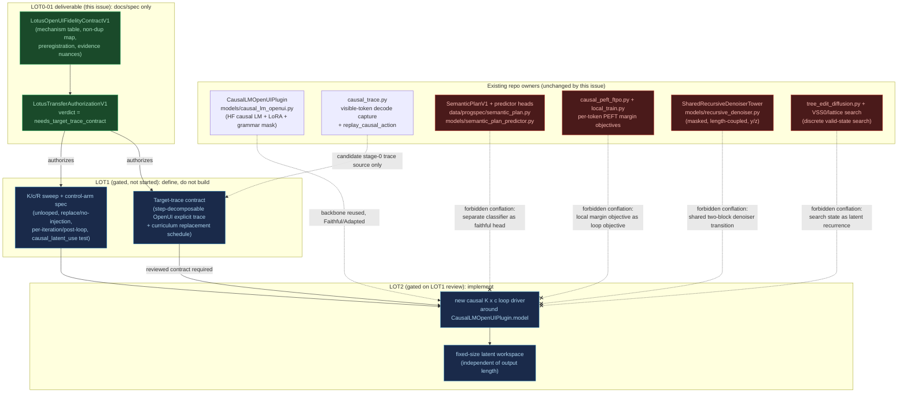

# LOT0-01: LOTUS-to-OpenUI fidelity contract, non-duplication map, and preregistered transfer gate

**Status:** docs/spec-only (SLM-248, LOT0-01). No model implementation, no corpus
generation beyond the bounded target-contract probes named in the authorization
below, no GPU training, no change to causal or TwoTower defaults. This document
plus [`lotus-openui-fidelity-contract-v1.json`](lotus-openui-fidelity-contract-v1.json)
are the source of truth for coding agents and reviewers; the Linear project
document is planning context only.

**Verdict:** `needs_target_trace_contract` — see
[Transfer authorization](#lotustransferauthorizationv1) below. This is not an
"authorize and build" outcome and not a "differentiation is weak, close the
project" outcome; it is a scoped prerequisite. Differentiation from every
existing repo mechanism survives line-by-line comparison (see
[Non-duplication map](#non-duplication-map)), but LOTUS's explicit-to-latent
curriculum presupposes a step-decomposable "explicit trace" for OpenUI program
synthesis that this repo does not yet define, and defining it is out of scope
for this docs-only issue.

## What "Faithful" means here, and where adaptation begins

A mechanism is **Faithful** only where this repo would reuse the *same causal,
recurrent, latent-prefix* math the LOTUS paper/code describe, on the existing
causal backbone ([`CausalLMOpenUIPlugin`](../../src/slm_training/models/causal_lm_openui.py)),
with no length-coupling, no discrete plan materialization, and no borrowed
denoiser/adapter/search machinery from an unrelated mechanism. It is
**Adapted** where the underlying idea transfers but the concrete artifact must
differ because OpenUI program synthesis is not GSM8K arithmetic CoT (the final
loss target, and the curriculum's trace source, are the two places this shows
up hardest). See the [mechanism fidelity table](#mechanism-fidelity-table) for
the row-by-row breakdown and the exact forbidden conflations.

## Primary sources and what was actually fetched

- **LOTUS paper**, arXiv:2606.31779 — fetched via WebFetch on 2026-07-21.
  Confirms the abstract-level architecture (looped causal backbone, K latent
  reasoning blocks, LM-head-projected supervision, 2.5x-6.9x reported
  thought-latency reduction, closing most of the gap to explicit CoT at 3B).
  **The full PDF (numeric GSM8K/SVAMP tables, per-config latency ms values) was
  not fetched in this session.** Those specific numbers are carried verbatim
  from the parent issue's preregistered evidence-nuances list (below) and are
  tagged `secondary_preregistered` in the JSON contract, not
  `primary_fetched` — this is an honest degradation the reviewer should know
  about, not a silent gap.
- **`yingfan-bot/lotus`** `scripts/lotus.py` and
  `args/gsm8k_lotus_llama3b.yaml` — fetched via WebFetch on 2026-07-21.
  Confirms concrete knobs: `c_thought` (latent positions per block, 25 for
  Llama), `n_looped_iters` (R), `block_start = loop_idx * c_thought` (K block
  indexing), `latent_injection_mode in {add, replace}` implementing
  `updated_embeds = original_embeddings + hidden_states` (the paper's
  `E + h_{t-1}`), a two-stage recipe (Stage-1 explicit-CoT SFT checkpoint,
  Stage-2 looped latent training with a `max_latent_stage` curriculum), an
  `intermediate_loss_after_loop` switch (per-iteration vs post-loop
  supervision), and reuse of the base model's own `lm_head`.
- **LOTUS / SLM-138 adversarial audit** (Linear doc, canonical audit per the
  parent issue) — **unresolved.** Not fetchable from this session (no Linear
  document-content tool was exercised against this specific doc id/URL).
  Recorded as an unresolved external reference per the issue's explicit
  instruction to proceed without it. This contract does not depend on any
  claim only that audit could supply, since every repository comparator below
  was read directly from source in this session.

Full source records (including the CODI comparator and the unresolved Linear
doc) are in
[`src/slm_training/resources/autoresearch/lotus-openui-sources.json`](../../src/slm_training/resources/autoresearch/lotus-openui-sources.json).

## LOTUS evidence nuances (preserved verbatim from the issue)

| Fact | Evidence class |
| --- | --- |
| 3B GSM8K explicit CoT 71.5 vs LOTUS 70.0 ± 0.9 and LOTUS+CODI 70.6 ± 0.2 | `secondary_preregistered` |
| thought 338.8→133.0 ms and compact total ≈2.12×, with 963.6/140.8≈6.84 from rounded natural-language values | `secondary_preregistered` (order-of-magnitude consistent with the fetched abstract's 2.5×-6.9× range) |
| CODI is faster than LOTUS under the compact protocol | `secondary_preregistered` |
| direct post-loop > per-iteration, while auxiliary routing reverses | `secondary_preregistered` (the `intermediate_loss_after_loop` switch confirms a real post-loop-vs-per-iteration control exists in the reference code; the reported direction/reversal was not independently re-derived) |
| public LOTUS receives substantial additional training after CoT initialization | `primary_fetched` — confirmed directly by the fetched YAML: 30 epochs / 1 epoch-per-curriculum-stage of Stage-2 looped training initialized from a Stage-1 checkpoint |
| decodability does not prove causal use | `secondary_preregistered` |
| independent token PCL has a residual dependency floor | `secondary_preregistered` |
| public SVAMP evaluation concatenates train/test and must not be presented as canonical test-only evidence | `secondary_preregistered` |

## Mechanism fidelity table

| LOTUS mechanism | Paper/code evidence | Proposed OpenUI owner | Fidelity | Required control | Forbidden conflation |
| --- | --- | --- | --- | --- | --- |
| pretrained causal LM backbone | paper Stage-1 init + `scripts/lotus.py` wrapper; `args/gsm8k_lotus_llama3b.yaml` `base_model=meta-llama/Llama-3.2-3B-Instruct` | `CausalLMOpenUIPlugin` ([`models/causal_lm_openui.py`](../../src/slm_training/models/causal_lm_openui.py)) | Faithful/Adapted | continued causal control | masked TwoTower denoiser |
| K reasoning blocks × c positions | latent prefix; `c_thought=25`, `block_start = loop_idx * c_thought` | **new causal K×c latent workspace module — not yet implemented, no existing repo owner** | Faithful | K/c sweep | target-length z state |
| whole-backbone recurrent passes | repeated causal forward; `for loop_idx in range(n_looped_iters)` reusing one backbone | same causal backbone (`CausalLMOpenUIPlugin.model`) reused by a new loop driver (not yet implemented) | Faithful | unlooped extra-update control | shared two-block denoiser transition |
| original embedding injection | `E + h_{t-1}`; `latent_injection_mode="add"` ⇒ `updated_embeds = original_embeddings + hidden_states` | same recurrence (new loop driver) | Faithful | replace/no-injection ablation | arbitrary y/z update |
| explicit-to-latent curriculum | progressively replace trace steps; `max_latent_stage` / `epochs_per_stage` over a Stage-1→Stage-2 recipe | compiler-trace curriculum — **target trace contract undefined, see authorization** | Adapted | continued explicit trace | direct latent-only scratch training |
| post-loop direct shared-head supervision | base LM head reused (`lm_head = base_model.lm_head`); direct post-loop > per-iteration, auxiliary routing reverses | causal LM output geometry (`CausalLMOpenUIPlugin.model`'s existing `lm_head`) | Faithful/Adapted | per-iteration + auxiliary controls | separate classifier claimed as faithful |
| final answer loss | short answer suffix CE; `intermediate_loss_weight`/`codi_loss_weight` are separate, smaller knobs | full OpenUI program/surface loss (existing SFT CE over the serialized program, e.g. `train_sft`) | Adapted | semantic-only/surface-only | assuming math payload equivalence |
| fixed R | loop count; `n_looped_iters` fixed per run, later ablated | fixed primary R in the new loop module config, later robustness sweep | Faithful | R sweep | adaptive halting in V1 |

Row-by-row rationale, including exactly which existing repo module each
forbidden conflation names, is in the JSON contract's
`mechanism_fidelity_table[*].notes`.

## Non-duplication map

Every comparator below was read directly from its source file in this
session, not inferred from prior summaries.

| # | Comparator | Owner code (read this session) | Verdict |
| --- | --- | --- | --- |
| 1 | RSC internal slots: masked bidirectional canvas, y/z recurrence, corrupted target, internal root/inventory probes | [`models/recursive_denoiser.py`](../../src/slm_training/models/recursive_denoiser.py) (`SharedRecursiveDenoiserTower`), routed from [`models/twotower.py`](../../src/slm_training/models/twotower.py) | `no_duplication` |
| 2 | SemanticPlanV1: externally materialized plan predictions, plan seed/feature consumers, topology/cardinality/pointer heads | [`data/progspec/semantic_plan.py`](../../src/slm_training/data/progspec/semantic_plan.py), [`models/semantic_plan_predictor.py`](../../src/slm_training/models/semantic_plan_predictor.py) | `no_duplication` |
| 3 | Causal adapters/FTPO: exact local decision training without a K×c latent prefix | [`harnesses/experiments/causal_peft_ftpo.py`](../../src/slm_training/harnesses/experiments/causal_peft_ftpo.py), [`harnesses/preference/local_train.py`](../../src/slm_training/harnesses/preference/local_train.py), [`harnesses/preference/causal_local_train.py`](../../src/slm_training/harnesses/preference/causal_local_train.py) | `no_duplication` |
| 4 | Explicit compiler traces: visible tokens and direct autoregressive training | [`models/causal_trace.py`](../../src/slm_training/models/causal_trace.py), [`harnesses/distill/trace_store.py`](../../src/slm_training/harnesses/distill/trace_store.py) | `no_duplication` |
| 5 | Flow/search: valid-state edits rather than continuous latent recurrence | [`models/tree_edit_diffusion.py`](../../src/slm_training/models/tree_edit_diffusion.py) (X22/D3), VSS0/lattice-recursive-search machinery | `no_duplication` |

**1 — RSC internal slots.** `SharedRecursiveDenoiserTower` recurses
`F_theta`/`G_theta` cross-attention blocks over a *masked, corrupted* target
canvas (`noisy_ids`) whose length is tied to the emitted program
(`self.z_latent[pos]`, `pos` derived from `noisy_ids.shape`), with coupled `y`
(token/position/kind) and `z` (learned latent + pooled context) states,
recursed `R = recursive_steps` times, bidirectionally. It is trained as a
denoiser against a corrupted target, not autoregressively. LOTUS's K×c
workspace is a **fixed-size** latent prefix on a **causal** backbone,
independent of output length, with no masking/corruption and no y/z split.

**2 — SemanticPlanV1.** `SemanticPlanV1` is a discrete, versioned,
provenance-tagged IR (`archetype` / `role_slots` / `topology`) that is
*externally materialized* and consumed to rank or seed compiler-legal
actions — per
[`semantic-planning-valid-state.md`](semantic-planning-valid-state.md)'s
`compiler-owned legality != learned semantic plan` division of labor, it never
gates legality. LOTUS's K×c blocks are continuous hidden states never
materialized as a discrete plan object and never used to rank or seed
compiler actions; their only external interface is the LM-head projection
used purely for the curriculum loss.

**3 — Causal adapters/FTPO.** `CausalPeftFtpoManifest` and the local-train
harnesses train small PEFT adapters (LoRA/DoRA/PiSSA/AdaLoRA) directly on
exact per-token `DecisionStateV2` events with clipped-margin objectives
(`unlikelihood` / `ftpo_single` / `ftpo_set` / `legal_set_mass`) — one forward
pass per captured decision, no recurrent loop, no latent prefix. LOTUS's K×c
loop reuses the same full backbone recurrently and is trained with
sequence-level SFT, not per-token local margin objectives.

**4 — Explicit compiler traces.** `causal_trace.py` captures per-step
*decoded, visible* token ids (raw argmax, legal set, constraint shadow) for
standard autoregressive cross-entropy training — every position is an
emitted, decodable token. LOTUS's curriculum explicitly *replaces* a growing
prefix of visible trace tokens with non-emitted latent positions supervised
only through an LM-head projection. The trace capture stays a candidate
*source* of stage-0 explicit trace tokens for a future curriculum, but the
curriculum/latent-substitution logic itself does not exist anywhere in this
repo yet — this is the exact gap the authorization below names.

**5 — Flow/search.** `tree_edit_diffusion.py` (X22/D3) and the
VSS0/lattice-recursive-search controller expand or edit a discrete,
always-valid partial program via typed tree edits or forest search, scored by
soft value nets over grammar/AST search state. LOTUS's K×c workspace is a
fixed continuous latent buffer with no discrete tree-edit action space and no
search/beam step.

**Required differentiators (must remain, or the transfer is not authorized):**
causal whole-backbone recurrent computation; fixed latent workspace
independent of output length; explicit trace-to-latent curriculum; direct
shared LM-head readout; built-in continued explicit control and causal
interventions. The last differentiator is **already partially satisfied** by
existing infrastructure: `causal_trace.py`'s `replay_causal_action` already
implements forced-action counterfactual replay on exact stored prefixes, which
is the substrate a `causal_latent_use` falsification test would need — this is
a finding worth carrying into LOT1, not a reason to skip defining that test.

## Architecture and control flow (faithful treatment + load-bearing controls)



Dashed arrows with an `x` mark the forbidden conflations from the mechanism
table: the new causal loop driver must not import `SharedRecursiveDenoiserTower`,
must not relabel a `SemanticPlanV1` predictor head as its post-loop readout,
must not fold its supervision into the FTPO per-token margin loss, and must
not describe itself as a tree-edit/lattice search arm.

## Preregistration

Claim classes: `wiring`, `faithful_mechanism_fixture`,
`optimization_diagnostic`, `semantic_quality`, `causal_latent_use`,
`latency_frontier`, `efficiency_frontier`, `adoption`.

- **Primary semantic endpoint:** `binding_aware_meaningful_v2`, on the frozen
  five-suite scoreboard (`smoke`, `held_out`, `adversarial`, `ood`,
  `rico_held`) already used across the repo's other preregistered campaigns.
- **Margins:**
  - Strict meaning-v2 paired **non-inferiority** margin: −0.02 absolute vs the
    frozen causal-track control (`CausalLMOpenUIPlugin` without the K×c loop),
    paired two-sided test, α=0.05.
  - AgentV paired **equivalence** margin: ±0.03 absolute on the pinned AgentV
    domain composite, TOST at α=0.05.
  - **Minimum effect for superiority:** +0.03 absolute
    `binding_aware_meaningful_v2` over control before any `semantic_quality`
    claim class may be filed.
  - **Maximum allowed regression by stratum:** no more than −0.01 absolute on
    any binding/AST stratum (rare-omission, minimal-valid-shell,
    deep-nesting); a stratum regression beyond this blocks promotion
    regardless of the aggregate result.
- **Matching rules:** equal optimizer updates; equal total token exposure;
  FLOP parity between the looped arm and an R-times-repeated unlooped control;
  identical frozen base parameter count (new loop/workspace parameters
  reported and held constant across ablation arms); identical wall-clock
  ceiling (this repo's 3-minute hard run cap per command) across screening
  arms.
- **Minimum seeds:** 3 screening, 5 adoption.
- **Checkpoint selection:** best checkpoint by `eval_loss` on a held-out split
  fixed before any semantic metric is computed — mirrors
  `CausalLMOpenUIPlugin.train_sft`'s existing
  `load_best_model_at_end=True` / `metric_for_best_model="eval_loss"`
  convention. The semantic endpoint is never used for checkpoint selection.
- **No-hidden-target contract:** no evaluation split may share compiler
  traces, prompts, or target programs with any training or
  curriculum-construction split. Any OpenUI-domain analogue of the SVAMP
  train/test-concatenation error invalidates the result outright, not just as
  a caveat.
- **Early-stop conditions:** (1) the target-trace contract cannot be defined
  without assuming math-payload equivalence to GSM8K CoT steps; (2) the
  unlooped extra-update control matches or beats the looped arm at matched
  updates/tokens/FLOPs; (3) the K×c workspace cannot be shown causally used —
  decodability alone (LM-head projection matching a gold trace token) is
  preregistered as **insufficient**, per the `decodability does not prove
  causal use` evidence nuance.
- **Project-close conditions:** differentiation from an existing repo
  mechanism collapses under implementation-level scrutiny; the target trace
  cannot be defined honestly without fabricating a step-decomposable
  OpenUI-domain CoT analogue; or an early-stop condition is met and not
  resolved by a re-scoped, separately preregistered follow-up.
- **"Near parity" is not formal equivalence.** An eyeballed gap between arms
  can never be reported as equivalence unless the declared paired
  equivalence/TOST test above was run and cleared.

Full machine-readable preregistration:
[`lotus-openui-fidelity-contract-v1.json`](lotus-openui-fidelity-contract-v1.json)
`.preregistration`.

## `LotusTransferAuthorizationV1`

**Verdict:** `needs_target_trace_contract`

Differentiation from every existing repo mechanism (masked recursive
denoiser, SemanticPlanV1 predictors/consumers, causal FTPO adapters, explicit
compiler traces, valid-state tree-edit/lattice search) is clean and survives
line-by-line comparison — every row of the non-duplication map above is
`no_duplication`. The blocker is narrower: LOTUS's explicit-to-latent
curriculum (mechanism row 5) and its `causal_latent_use` claim class both
presuppose a step-decomposable "explicit trace" analogous to GSM8K CoT steps
that this repo does not yet define for OpenUI program synthesis. Defining that
target-trace contract honestly — without assuming math-payload equivalence to
GSM8K, and without silently reusing `causal_trace.py`'s visible-token decode
capture or `SemanticPlanV1`'s plan IR as if either already were that trace —
is out of scope for this docs/spec-only issue (no corpus generation beyond
bounded target-contract probes). Authorizing bounded implementation now would
force either an undefined curriculum or a quietly borrowed non-LOTUS trace
source; neither is honest. This is not a "differentiation is weak" close and
not a semantic-floor block — it is a scoped prerequisite.

**Allowed LOT1 work:**
- Define the OpenUI target-trace contract: what constitutes an explicit,
  step-decomposable intermediate trace for a generated OpenUI program, how
  curriculum stages progressively replace trace-step token spans with K×c
  latent positions, and how R relates to trace length.
- Specify the K/c/R sweep grid, the unlooped extra-update control, and the
  replace/no-injection ablation as a preregistered fixture-scale experiment
  plan (no training).
- Extend `causal_trace.py`'s existing `replay_causal_action` counterfactual
  capture only insofar as needed to *define* (not run) a `causal_latent_use`
  falsification test for the K×c workspace.
- Bounded target-contract probes explicitly permitted by the parent issue
  (reading/inspecting a handful of existing compiler/decision traces to check
  step-decomposability; no corpus build).

**Allowed LOT2 work (gated on a reviewed LOT1 contract):**
- Implement the K×c latent workspace and loop driver around
  `CausalLMOpenUIPlugin.model`, gated on a reviewed LOT1 target-trace contract
  and an unchanged re-check of this authorization's verdict.
- Wire the explicit-to-latent curriculum against the LOT1-defined trace
  source, with the continued-explicit-trace control running throughout.

**Blocked work and claims:**
- No model or training code for the K×c workspace before a LOT1 target-trace
  contract exists and is reviewed.
- No GPU training, no corpus generation beyond the bounded LOT1 probes above.
- No change to causal or TwoTower defaults.
- No claim that LOTUS's reported GSM8K/SVAMP numbers, latency multipliers, or
  CODI comparison transfer to OpenUI; those remain `secondary_preregistered`
  evidence nuances until an OpenUI-domain measurement exists.
- No `causal_latent_use` claim from decodability alone.
- No relabeling of `causal_peft_ftpo.py`, `semantic_plan_predictor.py` heads,
  `recursive_denoiser.py`, `tree_edit_diffusion.py`, or `causal_trace.py`'s
  decode capture as the LOTUS mechanism rows they are explicitly distinguished
  from above.
- No SVAMP-style (or any) train/test-concatenated evaluation presented as
  canonical test-only evidence for any OpenUI-domain analogue benchmark.

**Comparator hashes** (sha256 of the exact files read and compared against in
this session — path + hash, not full content):

| Path | sha256 |
| --- | --- |
| `src/slm_training/models/recursive_denoiser.py` | `67ab44c54e772df8042b42cd7beb9b31a673a3e58949ae3f4a83e91173195cd8` |
| `src/slm_training/models/twotower.py` | `85489d2d591a62001ee57a19a20dc20141039677791a874b198ad798a8daa9ee` |
| `src/slm_training/models/semantic_plan_predictor.py` | `6d0e8176f636c80721947e25707ceee73270ebe2d7a7fb44e3720eb5a3d8850e` |
| `src/slm_training/data/progspec/semantic_plan.py` | `274722443338f6043b1d9357a10670554e9a87b57775627fdd369cdd2300e593` |
| `src/slm_training/models/causal_lm_openui.py` | `1a3630e96951f8785eb754e06ddb55c2b8e64760aad6929024b31def90755f05` |
| `src/slm_training/models/causal_trace.py` | `d73ca6e3d73681d5e38cef514d915416e9a6aef7d05f10858191c38c72ef96f0` |
| `src/slm_training/harnesses/experiments/causal_peft_ftpo.py` | `cf2cf49eed165edf1861cb4d6b13880fbda1e34d9c129cee9abf5d1887af8d58` |
| `src/slm_training/harnesses/preference/local_decisions.py` | `457b30c337437614a2bd68c0287232da1ab636fe2c0c33e40e403a86933e4118` |
| `src/slm_training/harnesses/preference/local_train.py` | `6e8dedc4d1cccbe5ed39d34f8a85b13d8df69802c214bcc0f374f49bebd95d2f` |
| `src/slm_training/models/tree_edit_diffusion.py` | `89b212dc46169d240101a4c4ca9eefc33cdd1ba29f56996d252a2ccc2cc40fc8` |
| `docs/design/local-decision-interventions.md` | `ee6493adf09b1864dce817b3dbc7848abdd4a1b1afe6cf1c26ac918d3587612f` |
| `docs/design/semantic-planning-valid-state.md` | `fd5cd811a262f4b0a3281870756bc341d668411f0f0a8e7333b0a220d5e0768f` |
| `docs/design/research-lineage.md` | `ca1439c787bd8465b5a298e8fbbd84016d46fa8634910e3cac7eabf7bc065ccb` (hash taken **before** this issue's own append to that file, so it is a stable comparator reference, not a self-referential hash) |

**Contract hash** (sha256 of the canonicalized JSON contract, computed over
every top-level key except `contract_hash` and `authorization`; see
`contract_hash_method` in the JSON for the exact recipe — re-verified by
[`tests/test_lotus_fidelity_contract.py`](../../tests/test_lotus_fidelity_contract.py)):

```
801ce267b64f52b88e6e80fa091084c5f1a6628de60658d2d161db82f5117af2
```

Full authorization object:
[`lotus-openui-fidelity-contract-v1.json`](lotus-openui-fidelity-contract-v1.json)
`.authorization`.
