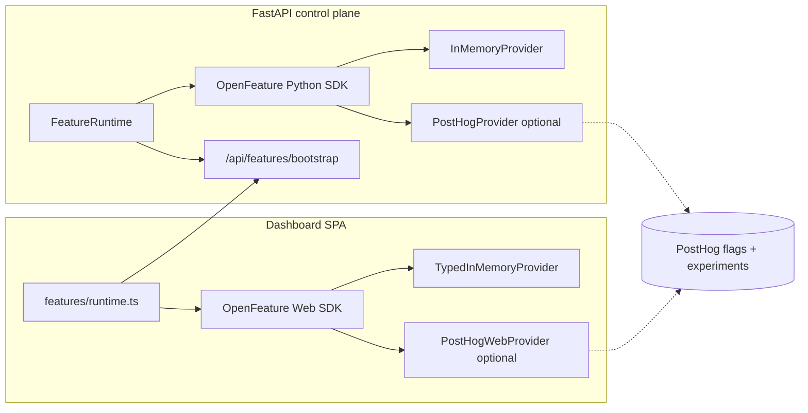

# OpenFeature product experiments

**Status:** implemented (v1 bootstrap + dashboard default-renderer experiment).

## Problem

This repository already has a mature **research experiment** stack (quality matrices,
autoresearch campaigns, ship gates, blinded checkpoint comparisons). Those are batch
ML ablations — not industry-standard **product experiments** (traffic-split feature
flags with exposure tracking).

Docs already anticipate runtime gates (`verified-scope-solver.md` decode flags;
`research-lineage.md` VSS behind a feature flag), but nothing wired a provider-neutral
evaluation API.

[OpenFeature](https://openfeature.dev) is the CNCF standard for feature flags. PostHog
ships official OpenFeature providers for Python and the browser, which maps cleanly to
our existing PostHog project for experiment analytics.

## Terminology (avoid collisions)

| Term in repo | Meaning | OpenFeature? |
| --- | --- | --- |
| `Experiment` in `run_quality_matrix.py` | ML ablation cell | No — keep as-is |
| `ExperimentSpec` in autoresearch | Hypothesis campaign | No |
| Ship / activation / deployment **gates** | Honest eval thresholds | No — never weaken via flags |
| **Product flag** (`slm_training.features`) | Runtime UI / decode toggles | Yes |

Ship gates and promotion criteria remain **fail-closed policy math**. Product flags may
only gate presentation or optional decode paths — never honest eval thresholds.

## Architecture

### Provider selection (server)

| `SLM_OPENFEATURE_PROVIDER` | `POSTHOG_API_KEY` set | Provider |
| --- | --- | --- |
| `in_memory` | * | `InMemoryProvider` (defaults + `SLM_FEATURE_OVERRIDES`) |
| `posthog` | required | `openfeature-provider-posthog` |
| `auto` (default) | yes | PostHog |
| `auto` | no | In-memory |

Install extras: `pip install -e '.[features]'` or `.[features-posthog]`.

### Bootstrap contract

`GET /api/features/bootstrap?targeting_key=<id>` returns:

- `provider` — `in_memory` | `posthog`
- `posthog` — `{ project_api_key, host }` when browser should use PostHog (public `phc_` key only)
- `defaults` — static fail-closed defaults from `slm_training.features.defaults`
- `evaluated` — server-side evaluation for the requested targeting key
- `targeting_key` — echo

The dashboard hydrates OpenFeature from this payload. User overrides (e.g. compiled
vs interpreted toggle) still persist in `localStorage`; the flag only sets the **default**
when no preference is stored.

## Flag registry (v1)

| Key | Type | Default | Surface |
| --- | --- | --- | --- |
| `dashboard.default-renderer` | string | `interpreted` | Dashboard ◈/◇ default |
| `vss.decode-enabled` | boolean | `false` | Future VSS decode path |
| `playground.grammar-constrained-default` | boolean | `true` | Playground generation default |

Add new keys in `slm_training/features/keys.py` + `defaults.py` and mirror
`src/apps/dashboard/src/features/keys.ts`.

## Environment

| Variable | Purpose |
| --- | --- |
| `SLM_OPENFEATURE_PROVIDER` | `auto` \| `in_memory` \| `posthog` |
| `POSTHOG_API_KEY` / `POSTHOG_PROJECT_API_KEY` | PostHog project key (`phc_…`) |
| `POSTHOG_HOST` | API host (default `https://us.i.posthog.com`) |
| `SLM_FEATURE_OVERRIDES` | JSON map for local in-memory overrides |

## Tracking / experiments

When the PostHog web provider is active, use OpenFeature `client.track()` for exposure
and conversion events (standard OpenFeature experiment pattern). Server-side evaluations
with PostHog emit `$feature_flag_called` when `send_feature_flag_events=True` (default).

## Out of scope (v1)

- Weakening ship gates or matrix experiment definitions via flags
- Replacing blinded checkpoint A/B (human review) with product flags
- Remote flag authoring UI (use PostHog)

## Versioning

Component id: `features.openfeature` in `versions.json`. Bump when flag defaults,
registry keys, or provider wiring change.
