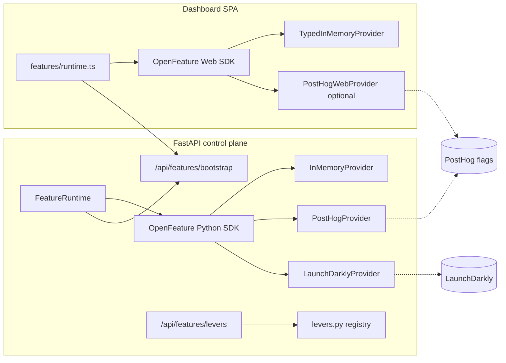

# OpenFeature product experiments

**Status:** implemented (v2 — multi-provider + experiment lever registry).

## Problem

This repository already has a mature **research experiment** stack (quality matrices,
autoresearch campaigns, ship gates, blinded checkpoint comparisons). Those are batch
ML ablations — not industry-standard **product experiments** (traffic-split feature
flags with exposure tracking).

Docs already anticipate runtime gates (`verified-scope-solver.md` decode flags;
`research-lineage.md` VSS behind a feature flag), but nothing wired a provider-neutral
evaluation API.

[OpenFeature](https://openfeature.dev) is the CNCF standard for feature flags.
**LaunchDarkly** and **PostHog** both ship official OpenFeature server providers,
so the control plane can swap vendors without changing call sites.

## Terminology (avoid collisions)

| Term in repo | Meaning | OpenFeature? |
| --- | --- | --- |
| `Experiment` in `run_quality_matrix.py` | ML ablation cell | No — keep as-is |
| `ExperimentSpec` in autoresearch | Hypothesis campaign | No |
| Ship / activation / deployment **gates** | Honest eval thresholds | No — never weaken via flags |
| **Product lever** (`slm_training.features.levers`) | Runtime rollout of a matrix hypothesis | Yes — flag key + metadata |
| **Product flag** (`slm_training.features`) | OpenFeature evaluation | Yes |

Ship gates and promotion criteria remain **fail-closed policy math**. Product flags may
only gate presentation or optional decode paths — never honest eval thresholds.

## Experiment lever design

Quality-matrix rows (E1 constrained decode, E4 schema conditioning, …) are **training
levers**: they change what the model learns. Product levers are the **rollout surface**
for the same hypothesis once it is ready for gradual exposure.

```text
Matrix row (E1)  →  train/eval harness knob  →  ship gates pass  →  product lever  →  OpenFeature flag
```

`slm_training.features.levers.PRODUCT_EXPERIMENT_LEVERS` is the canonical registry:

| Lever id | Flag key | Kind | Matrix ref |
| --- | --- | --- | --- |
| `dashboard-renderer` | `dashboard.default-renderer` | ui | — |
| `vss-decode` | `vss.decode-enabled` | decode | `verified-scope-solver.md` |
| `playground-grammar-default` | `playground.grammar-constrained-default` | ui | — |
| `E1-constrained-decode` | `decode.grammar-ltr-repair` | decode | quality matrix E1 |
| `E4-schema-conditioning` | `decode.schema-in-context` | decode | quality matrix E4 |

`GET /api/features/levers` exposes this registry for dashboards and tooling.

**Provider affinity** (`launchdarkly`, `posthog`, `any`) is documentation-only in v2 —
all providers evaluate the same flag keys. Prefer LaunchDarkly for enterprise rollout
and staged percentage experiments; PostHog when experiment analytics should stay in the
same project as product telemetry.

## Architecture



### Provider selection (server)

| `SLM_OPENFEATURE_PROVIDER` | Env keys | Provider |
| --- | --- | --- |
| `in_memory` | * | `InMemoryProvider` (defaults + `SLM_FEATURE_OVERRIDES`) |
| `launchdarkly` | `LAUNCHDARKLY_SDK_KEY` required | `launchdarkly-openfeature-server` |
| `posthog` | `POSTHOG_API_KEY` required | `openfeature-provider-posthog` |
| `auto` (default) | LD key → LD; else PH key → PH; else in-memory | first match |

Install extras:

```bash
pip install -e '.[web]'                        # in-memory (openfeature-sdk in web extra)
pip install -e '.[web,features-posthog]'       # PostHog
pip install -e '.[web,features-launchdarkly]'  # LaunchDarkly
```

### Bootstrap contract

`GET /api/features/bootstrap?targeting_key=<id>` returns:

- `provider` — `in_memory` \| `posthog` \| `launchdarkly`
- `posthog` — `{ project_api_key, host }` when browser should use PostHog client SDK
- `launchdarkly` — `true` when server evaluated via LD (browser uses evaluated snapshot only; SDK key stays server-side)
- `defaults` — static fail-closed defaults
- `evaluated` — server-side evaluation for the targeting key
- `levers` — experiment lever registry snapshot
- `targeting_key` — echo

**LaunchDarkly browser model:** server-side evaluation only. The LD SDK key is secret
and never sent to the browser. The dashboard hydrates `TypedInMemoryProvider` from
`evaluated` (same fallback path as PostHog provider errors).

PostHog browser model: optional client SDK via `@posthog/openfeature-web-provider` when
`posthog` config is present; falls back to evaluated snapshot on error.

User overrides (compiled vs interpreted toggle) persist in `localStorage`; the flag
only sets the **default** when no preference is stored.

## Flag registry (v1)

| Key | Type | Default | Surface |
| --- | --- | --- | --- |
| `dashboard.default-renderer` | string | `interpreted` | Dashboard ◈/◇ default |
| `vss.decode-enabled` | boolean | `false` | Future VSS decode path |
| `playground.grammar-constrained-default` | boolean | `true` | Playground generation default |

Decode rollout flags (`decode.grammar-ltr-repair`, `decode.schema-in-context`) are
registered in the lever table but not yet wired into decode paths — add keys to
`keys.py` / `defaults.py` when implementation lands.

## Environment

| Variable | Purpose |
| --- | --- |
| `SLM_OPENFEATURE_PROVIDER` | `auto` \| `in_memory` \| `posthog` \| `launchdarkly` |
| `LAUNCHDARKLY_SDK_KEY` / `LD_SDK_KEY` | LaunchDarkly server SDK key |
| `POSTHOG_API_KEY` / `POSTHOG_PROJECT_API_KEY` | PostHog project key (`phc_…`) |
| `POSTHOG_HOST` | API host (default `https://us.i.posthog.com`) |
| `SLM_FEATURE_OVERRIDES` | JSON map for local in-memory overrides |

## Tracking / experiments

- **PostHog:** `client.track()` from dashboard; server emits `$feature_flag_called` by default.
- **LaunchDarkly:** use `LaunchDarklyProvider.track()` server-side or LD custom events via the native client exposed through the provider when needed.

## Out of scope (v2)

- Weakening ship gates or matrix experiment definitions via flags
- Replacing blinded checkpoint A/B (human review) with product flags
- Remote flag authoring UI (use LaunchDarkly or PostHog consoles)
- Wiring `decode.*` flags into the generation path (registry only)

## Versioning

Component id: `features.openfeature` in `versions.json`. Bump when flag defaults,
registry keys, lever table, or provider wiring change.
