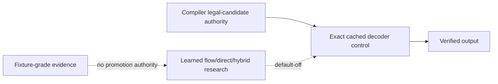

# Valid-edit flow authority map (SLM-207)

```mermaid
flowchart LR
  Compiler[Compiler legal-candidate authority] --> Exact[Exact cached decoder control]
  Exact --> Output[Verified output]
  Learned[Learned flow/direct/hybrid research] -. default-off .-> Exact
  Fixture[Fixture-grade evidence] -. no promotion authority .-> Learned
```

Selected runtime: `exact_cached_decoder_control`. Learned authority: none.
